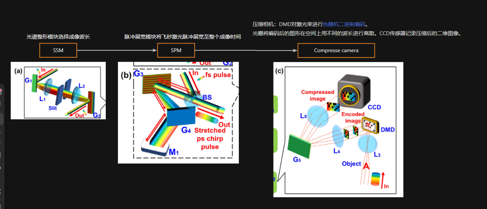

# Ultrafast optical imaging
## 压缩超快时间光谱成像术(CUST)和压缩超快摄影(CUP)综述

---
layout: cover
---

# 1.超快成像领域综述
## 1.1 分类和比较
--- 

# Achieve ways
> 超快成像的方式大致可分为下面几类

 

+ 多次曝光
    +  Temporal 时间
    +  Spatial 空间
+ 单次曝光
    + 主动
        + Angle division
        + Wavelength division
        + Frequency division
    + 被动   
        + 直接成像
        + 计算重建

> Generally, there are two ways to achieve UOI, one is multiple-shot measurement ,and
the other is single-shot measurement。

--- 

# Comparison of multiple-sho and single-shot

+ `multiple-shot measurement` 现在已经在多个
领域中被广泛应用，但其要求观测的场景是可重复的，并且对实验的稳定性要求性
高。

+ 而 `single-shot measurement` 克服了这些缺点，在**探测不可逆或随机动态场**景中显示
出不可替代的作用。并且在过去的十年中，这种 single-shot 方法快速发展。

## 多次曝光超快成像技术
利用泵浦探测技术，通过多次重复观测同一场景的不同时间片段，然后将它们拼接成一幅完整的超快图像。

+ 优点
    + 获得高分辨率和高信噪比的图像、
+ 缺点
   + 只能观测稳定和可重复的超快过程，不能观测不可逆或难以重复的超快过程。

## 单次曝光超快成像技术
+ 利用光场调制或信息复用技术，通过单次曝光就能够捕捉整个超快过程的图像。
 + 优点
    + 可以观测不可逆或难以重复的超快过程
    + 实现实时观测和高帧率成像
 + 缺点
    + 图像分辨率和信噪比较低
    + 需要复杂的图像重建算法1。

---
layout: cover
---

# 1.超快成像领域综述
## 1.2 常见的比较热门的技术

+ Single-shot polarization-resolved ultrafast mapping photography,PUMP
+ Compressed Ultrafast Photography，CUP
+ Compressed Ultrafast Spectral-Temporal Photography（CUST）

> 泵浦-探测方法依赖于泵浦和探测之间具有不同时间延迟的多次测量，并且只能应用于可重复的过程。测量超快、不可重复的现象。近年来，出现了多种单扫描超快成像技术，如STEAM 、 CUP 、STAMP 、FRAME 

--- 

## Single-shot polarization-resolved ultrafast mapping photography,PUMP

 (PUMP) 是一种新颖的超快成像技术，它通过将时间信息转换为偏振信息，实现了对瞬态场景的快照测量。

利用旋转偏振激光脉冲作为探测光，将时间信息转换为**偏振维度**的单次超快成像技术，可以实现高帧率、高频谱分辨率和大帧数的成像，以及可调节的成像速度。

--- 

## Compressed Ultrafast Photography，CUP
压缩超快摄影( Compressed Ultrafast Photography，CUP )是一种新兴的single-shot measurement it has achieved a world record imaging speed of 10 trillion frames per second (Tfps)，序列深度可达几百帧。

---
layout: cover
---

# 2.compressed ultrafast spectral temporal photography
## CUST 压缩光谱-时间技术综述

--- 

#  CUST 压缩光谱-时间技术
一种利用拉伸啁啾脉冲和编码数字微镜器件（DMD）模式来压缩记录超快过程或光谱信息的方法。

## 原理

拉伸啁啾脉冲可以离散为不同时间或波长的帧，每个帧与DMD模式相乘后通过一个4f系统和一个光栅投影到CCD平面上，不同波长的帧在x轴上有一定的位移。

> https://heurm.yuque.com/fe7gdf/mg1pn6/tyltup636b96k6ig?singleDoc# 《compressed ultrafast spectral temporal photography》

--- 

<!--  -->

--- 

+ SSM 通过在4F系统的傅里叶平面上调谐一个狭缝来选择飞秒激光的频谱。 The SSM can also be used to calibrate the CUST photography system 。

+ 在 SPM 模块， fs pulse 被一个光栅对拉宽。

- 第三部分
   -  编码后的光束通过一组光路$[L_4,G_5,L_5]$, 透镜L4和L5组成4F系统。光栅G5放置在4F系统的傅里叶平面上。分散光束由CCD传感器接收。  
   -  然后通过成像透镜$L_3$将光束投射到 digital micro-mirror device(DMD) 上，进行编码。  

 

$S=E \cdot I \cdot O$

--- 

 对于展宽啁啾脉冲，时间t与波长λ有关  
$$
\Delta t= \frac{d^{2}\varphi}{d \omega ^{2}}\Delta \omega = \frac{2 \pi c \varphi ^{\prime \prime}}{\lambda _{0}^{2}}\Delta \lambda
$$
$\varphi''$二阶色散，$\lambda_{0}$是中心波长,一个超快过程可以离散化为一组$O(x,y,t_{i})$，经过DMD编码后变为$S(x,y,t_{i})$。又因为$t_{i},\lambda_{i}$相关。
$$S(x,y,t_{i})=E(x,y)\cdot I \left[ x,y,t_{i}\right] \cdot O(x,y,t_{i}) 
\tag{1.1}$$
$$ 
S(x,y,\lambda_{i})=E(x,y)\cdot I \left[ x,y,\lambda_{i}\right] \cdot O(x,y,\lambda_{i}) \tag{1.2}
$$
$S(x,y,\lambda_{i})$通过4f系统和光栅成像到CCD平面上。 展宽脉冲的时空分布表示为$I \left( x,y,t_{i}\right)$。在场景平面，展宽脉冲通过超快物体$O(x,y,t_{i})$传输；光束通过成像透镜$L_3$将光束投射到数字微镜器件( DMD )上。DMD用伪随机二值模式$E(x,y)$对光束进行空间编码，得到的图像S写为  $(1.1)$或$(1.2)$式。

---

可达到`3.85 trillion Hz`

---
layout: cover
---
# 3.Compressed Ultrafast Photography
## 压缩超快摄影(CUP)综述

--- 

CUP是一种新兴的单次拍摄计算成像技术，其成像速度高达每秒`10万亿帧`，序列深度可达`几百帧`。

该技术将压缩感知和条纹相机技术结合起来，以单次拍摄捕捉不可重复的超快瞬态事件。近年来，该方法得到了前所未有的技术发展和扩展，在超快光学成像与计量、超快电子衍射与显微成像、信息安全防护等领域得到了广泛应用。

CUP实现了前所未有的单发探测可视化不可逆瞬态现象的能力。此外，在数据采集和图像重建方面的各种技术改进都加强了这项技术的能力。
<!-- 我们回顾了CUP的基本原理，它在数据采集和图像重建方面的最新进展，它与其他模态的融合，以及它在多个研究领域的独特应用。 -->

--- 

一个 CUP 实验包括数据采集和数据处理
两个部分。

数据采集部分如右图所示。一
个物体首先通过相机镜头和由管透镜和显
微镜物镜组成的 4f 成像系统在数字微镜
器件 ( DMD ) 上成像。

随后，其被 DMD 进行空间编码，随后反
射的像被同样的 4f 成像系统采集。最后通
过条纹相机对其进行偏转和测量。

 
<!--  -->

--- 

## DMD
一个DMD由数十万个微镜组成；其中每一个可以单独旋转12 deg，代表开启或关闭状态。因此可以对投影在DMD上的动态场景进行空间编码。被掩膜后的光强分布
$$
    I_{c}(x,y,t)= \sum _{i,j}I(x,y,t)C_{i,j}rect \left[ \frac{x}{d}-(i+ \frac{1}{2}), \frac{y}{d}-(j+ \frac{1}{2})\right] 
$$

$C_{i,j}$是表示编码掩码的矩阵的元素，
I j是矩阵元素的指标，
d是掩模像素大小，相当于一个分格的DMD或CCD像素。对于这两个维度，矩形函数(rect)定义为

  $$\left\{ \begin{matrix} rect(x)= 1, if |x| \leq \frac{1}{2}  \\ 0, else \end{matrix} \right.$$
  然后，通过沿垂直y0轴施加电压斜坡，将编码后的动态场景在时域上被条纹相机剪切，可表示为

  $$ I_{s}(x,y,t)=I_{c}(x,y-vt,t) $$

---

可以从重建算法方面入手优化。

--- 

# 来源论文信息

+ Compressed Ultrafast Spectral-Temporal Photography
     + 期刊: Physical Review Letters

+ Single-shot compressed ultrafast photography: a review
    + 期刊： Advanced Photonics  ADVANCED PHOTONICS 

--- 
layout: cover
---

# THANKS!